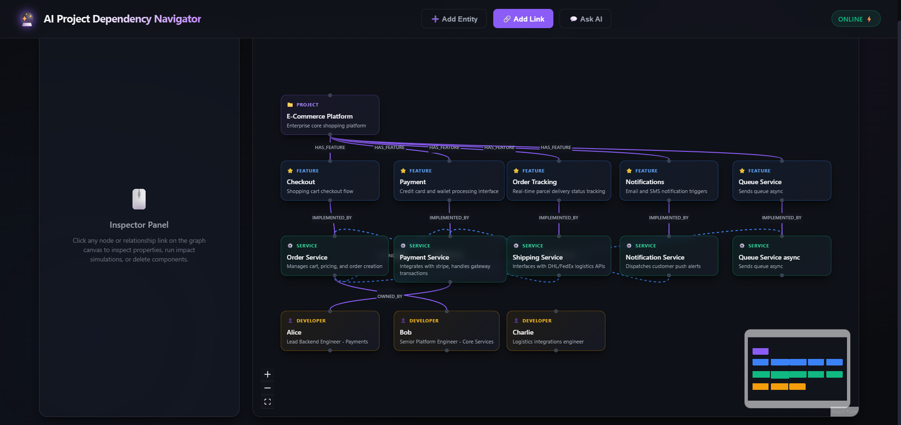
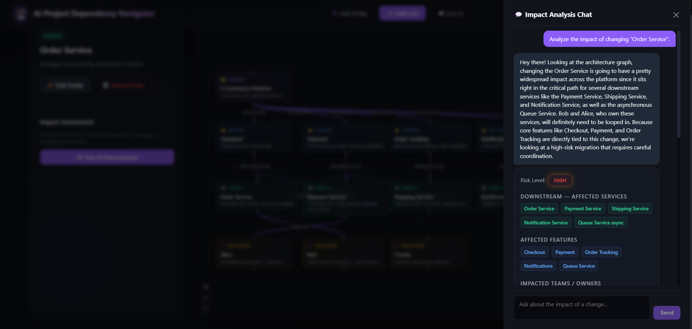
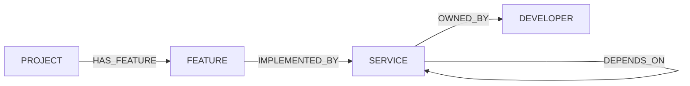

# AI Project Dependency Navigator

> Model your projects, features, services, and developers as a dependency graph, then ask — in
> plain English — "what could be affected if I change this?" — and get an AI-generated impact
> analysis grounded in the actual graph, not a guess.


Demo Link: https://raggraph-production.up.railway.app/

## Table of contents

- [Use case](#use-case)
- [Features](#features)
- [How it works](#how-it-works)
- [UI walkthrough](#ui-walkthrough)
- [Why a graph database?](#why-a-graph-database)
- [Data model](#data-model)
- [Tech stack](#tech-stack)
- [Setup & run instructions](#setup--run-instructions)
- [Main queries explained](#main-queries-explained)
- [API overview](#api-overview)

## Use case

Engineering orgs accumulate dependencies faster than anyone can track in a spreadsheet —
projects have features, features are implemented by services, services depend on other services,
and services are owned by developers or teams. When someone wants to change, migrate, or retire a
service, answering "what breaks?" usually means grepping docs, Slack history, or tribal knowledge.

This tool models that graph directly and lets you ask it questions in plain English:

- *"What's the impact of migrating the notification service?"*
- *"Who owns the payment service?"*
- *"What's the path between the checkout feature and the shipping service?"*

Every answer is backed by real graph traversal — not a hallucinated guess.

## Features

- 🗺️ **Visual dependency graph** — create, connect, and inspect projects/features/services/
  developers on a canvas
- 💬 **Conversational impact analysis** — ask free-text questions, get graph-grounded answers; a
  plain lookup and a full impact analysis both come from the same single retrieval pass, no fixed
  intents to slot the question into
- 🌐 **Whole-graph fallback** — if nothing in the question matches an existing entity, Gemini
  reasons over the entire known graph instead of failing to answer (e.g. open-ended planning
  questions like "what existing services could I reuse for a new email workflow?")
- 🔍 **Graph-native search** — CognoDB full-text entity linking, no vector DB required
- 🛡️ **Polished UX** — loading/empty/error states throughout, in-app confirm dialogs, error
  boundary

## How it works

```text
React → Express (backend/) → CognoDB search + traversal → structured graph facts → Gemini → conversational answer → React
```

The chat agent resolves whatever the message mentions via a CognoDB full-text search over entity
name/description, then compiles a single graph context around every match — direct connections,
downstream/upstream service impact, affected features/projects, owners, and paths between the
matches. That context (not a fixed intent) is handed to Gemini once, and it answers freely: a plain
lookup ("who owns X?") and a full impact analysis ("what breaks if I change X?") come from the same
retrieval, with Gemini deciding which parts of its structured output (risk, recommended tests,
explanations) actually apply to the question asked — the retrieve-then-generate shape of RAG, with
the graph as the retrieval source instead of a vector store.

If nothing in the message matches an existing entity, the backend doesn't dead-end — it falls back
to handing Gemini the *entire* known graph instead. Still pure CognoDB-retrieved facts, just a
wider net, so open-ended questions that don't name anything specific ("what existing services could
I reuse for a new email workflow?") still get a grounded answer.

## UI walkthrough

**1. The graph canvas.** Nodes are color-coded by type (purple `PROJECT`, blue `FEATURE`, green
`SERVICE`, amber `DEVELOPER`), edges are labeled with their relationship type, and the Inspector
Panel on the left stays empty until you select something:



Header actions: **➕ Add Entity**, **🔗 Add Link**, **💬 Ask AI**, and a live backend/DB connection
status badge.

**2. Building the graph.**
- **➕ Add Entity** — create a `PROJECT` / `FEATURE` / `SERVICE` / `DEVELOPER` (name + description)
- **🔗 Add Link** — connect two entities; the relationship-type dropdown and target-entity list
  filter live to only valid pairings for the schema, so an invalid edge can't be created from the
  UI (e.g. a `SERVICE` source only offers `DEPENDS_ON`→`SERVICE` or `OWNED_BY`→`DEVELOPER`)

**3. Inspecting the graph.** Click any node or edge and the Inspector Panel updates:
- **Node** → type badge, name, description, Edit/Delete actions. `SERVICE` nodes also get a
  **💬 Ask AI About Impact** button.
- **Edge** → relationship id + Delete action.
- Deleting either opens an in-app confirm dialog — no browser popups.

**4. Asking the chat agent.** Open the drawer from the header's **💬 Ask AI**, or from a selected
service's **Ask AI About Impact** (pre-fills the question):



Type a free-text question — the agent resolves the entities mentioned via CognoDB's full-text
search, compiles the surrounding graph context in one pass, and replies conversationally. The
reply is followed by whichever structured facts actually apply: risk level, downstream/upstream
services, affected features/projects, owners, recommended tests, explanations, direct connections,
or paths between matched entities — populated only when the question calls for them, never forced
into every answer. If nothing in the message matches an existing entity, the agent reasons over the
whole known graph instead of refusing to answer. History carries across turns in the same session.

## Why a graph database?

Dependency chains are inherently graph-shaped — variable-depth, directional, and the interesting
questions are almost always about *paths* and *reachability*: "what, transitively, depends on
this?", "what's the shortest connection between these two things?" A relational database answers
that with recursive CTEs or an unbounded chain of self-joins that gets slower and uglier the
deeper it goes. A graph database answers it with one Cypher pattern:

```cypher
MATCH (s:Entity {id: $id})<-[:DEPENDS_ON*1..5]-(dependent:Entity) RETURN dependent
```

Relationships are first-class, so traversal — not joining — is the native operation. That's why
this project pairs a document store (MongoDB, for entity metadata) with a graph database
(CognoDB, for relationships): metadata is document-shaped, dependencies are graph-shaped, and
forcing either into the other's model is where the pain starts.

## Data model



- **MongoDB** — the entity registry. Each `PROJECT` / `FEATURE` / `SERVICE` / `DEVELOPER` is a
  document with `id`, `name`, `description`. No relationship data lives here.
- **CognoDB** — the graph. Every entity is also a `(:Entity {id, type, name, description})` node
  (name/description are cached here too, so the graph can be searched without touching MongoDB —
  see [Main queries](#main-queries-explained)); edges are the four directed relationship types
  above. CognoDB never stores anything MongoDB doesn't already have — it's a graph-native mirror
  of the same entities, plus the relationships between them.
- **Gemini** — stateless reasoning only. It never queries either database directly; the backend
  always retrieves first (Mongo lookup or CognoDB traversal), compiles the results into plain
  facts — a targeted context around matched entities, or the whole graph if nothing matched — and
  only then hands them to Gemini to answer freely.

## Tech stack

| Layer | Technology |
|---|---|
| Frontend | React 19, Vite, TypeScript, React Flow (`@xyflow/react`) |
| Backend | Node.js, Express, TypeScript (`tsx`) |
| Entity metadata | MongoDB (Mongoose) |
| Graph / relationships | CognoDB (Neo4j-compatible, via `neo4j-driver`) |
| AI reasoning | Gemini API (`@google/generative-ai`), structured JSON output mode |
| Logging | Winston (console-only, scoped per controller/service) |

## Setup & run instructions

### Prerequisites

- Node.js **v20+** (developed on v24 LTS)
- npm (workspaces-aware — this is an npm workspaces monorepo, one `npm install` at the root
  installs both `backend/` and `frontend/`)
- A MongoDB instance (MongoDB Atlas cloud cluster recommended)
- A CognoDB instance (see below)
- A Gemini API key

### 1. Create your CognoDB instance

1. **Create an account** at `https://console.cognodb.com/signup` — the free tier requires no
   credit card.
2. **Create a free instance** — pick a region, it provisions in under a minute. Each workspace
   gets one free instance.
3. **Save your connection details** — you'll get a URI of the form
   `bolt+s://<instance-id>.databases.cognodb.cloud` and a generated password for the user
   `cognodb`, shown **exactly once**. Copy it immediately.
4. No schema setup needed — this app creates its own full-text index on first connection (see
   [Main queries](#main-queries-explained)).

### 2. Create your MongoDB instance

1. Create a free cluster on [MongoDB Atlas](https://www.mongodb.com/cloud/atlas).
2. Add a database user and allow network access (or allow-list `0.0.0.0/0` for local dev).
3. Copy the connection string from the Atlas "Connect your application" dialog.

### 3. Get a Gemini API key

Create one at [Google AI Studio](https://aistudio.google.com/apikey).

### 4. Configure environment variables

Create `backend/.env`:

```bash
PORT=5000
MONGODB_URI=<your MongoDB Atlas connection string>
COGNO_API_URL=bolt+s://<instance-id>.databases.cognodb.cloud
COGNO_USER=cognodb
COGNO_PASSWORD=<your CognoDB password>
GEMINI_API_KEY=<your Gemini API key>
```

### 5. Install and run

```bash
npm install    # installs both workspaces from the repo root
npm run dev    # starts backend (:5000) and frontend (:5173) together, both hot-reloading
```

On first run against an empty database, the backend auto-seeds sample projects/features/services/
developers (see `backend/src/utils/seeder.ts`).

For a production-style single-process build:

```bash
npm run build
NODE_ENV=production npm start   # one process, one port — serves the API and the built frontend
```

## Main queries explained

All Cypher lives in `backend/src/services/cognoService.ts`:

| Query | What it does |
|---|---|
| `searchEntities` | Entity linking for the chat agent — `CALL db.index.fulltext.queryNodes('entitySearchIndex', ...)` against a full-text index (auto-created on connect: `CREATE FULLTEXT INDEX entitySearchIndex ... ON EACH [n.name, n.description]`), so free text like "notification service" ranks against names *and* descriptions entirely inside CognoDB — no MongoDB involved. |
| `findShortestPath` | `shortestPath((a)-[*..8]-(b))` between two arbitrary entities, any relationship direction/type. Capped at 8 hops so an unrelated pair fails fast instead of scanning indefinitely. Used to surface how every pair of matched entities connects. |
| `getRelationships` | Every `(:Entity)-[r]->(:Entity)` edge in the graph — the raw material two functions in `graphTraversalService.ts` build on: `compileContext` BFSs over it for downstream/upstream impact, affected features/projects, and owners around the matched entities; `compileGraphSummary` uses it wholesale (every entity + every relationship) for the whole-graph fallback when nothing matched. |

## API overview

| Method | Route | Purpose |
|---|---|---|
| GET | `/api/health` | Backend + DB connection status |
| GET / POST | `/api/entities` | List / create entities |
| GET / PATCH / DELETE | `/api/entities/:id` | Read / update / delete one entity |
| GET / POST | `/api/relationships` | List / create relationships |
| DELETE | `/api/relationships/:id` | Delete a relationship |
| GET | `/api/graph` | Full graph (nodes + edges) for the canvas |
| POST | `/api/chat` | The conversational GraphRAG agent — `{ message, history }` in, `{ reply, risk?, recommendedTests?, explanations?, context?, matchedEntities }` out |
