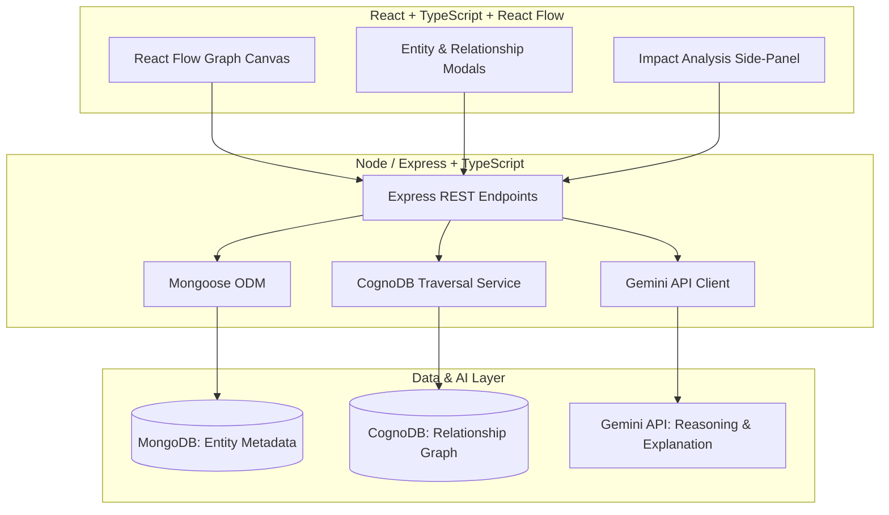

# AI Project Dependency Navigator - Minimal Architecture Proposal (TypeScript)

This plan outlines the minimal, lightweight architecture, database boundaries, and type definitions for the 30-hour POC of the **AI Project Dependency Navigator** using **TypeScript** on both frontend and backend.

## User Review Required

> [!IMPORTANT]
> To hit the 30-hour POC target while maintaining type safety:
> - **Build/Execution tooling**: We will use `tsx` or `ts-node-dev` for fast development execution in the backend without requiring a separate watch/build step, and standard `vite` (react-ts template) for the frontend.
> - **Shared Interfaces**: We will maintain a clean set of shared interface definitions (e.g., `Entity`, `Relationship`, `ImpactAnalysisResult`) to ensure the frontend contracts perfectly match backend API responses.

## Open Questions

> [!IMPORTANT]
> 1. **CognoDB Cloud Connection Details**: Do you have a live CognoDB Instance/Cloud URI and access credentials ready, or should we prepare a local mock layer in the backend that implements the same CognoDB client interface for easy testing?
> 2. **Gemini API Key**: Do you have a Gemini API key configured in your local environment, or should we implement the Gemini Node SDK with a placeholder `.env` variable for you to supply?
> 3. **MongoDB Connection**: Will we connect to a local MongoDB instance (e.g. `mongodb://localhost:27017/dep-nav`) or MongoDB Atlas?

---

## Type Definitions & Domain Model

We will define clear types/enums to enforce validity on both the server and client.

```typescript
export type EntityType = 'PROJECT' | 'FEATURE' | 'SERVICE' | 'DEVELOPER';

export type RelationshipType = 'HAS_FEATURE' | 'IMPLEMENTED_BY' | 'DEPENDS_ON' | 'OWNED_BY';

export interface Entity {
  id: string;
  type: EntityType;
  name: string;
  description: string;
  createdAt?: Date;
}

export interface Relationship {
  id: string;
  fromEntityId: string;
  toEntityId: string;
  type: RelationshipType;
}

export interface GraphData {
  nodes: Array<{
    id: string;
    type: EntityType;
    data: {
      label: string;
      description: string;
    };
  }>;
  edges: Array<{
    id: string;
    source: string;
    target: string;
    label: RelationshipType;
  }>;
}

export interface ImpactAnalysisResult {
  target: string;
  risk: 'LOW' | 'MEDIUM' | 'HIGH';
  summary: string;
  affectedServices: string[];
  affectedFeatures: string[];
  developers: string[];
  paths: string[][];
  recommendedTests: string[];
  explanations: string[];
}
```

---

## Minimal Architecture & Data Store Boundaries

### System Component Map


### Responsibility & Boundary Definitions

1. **MongoDB (Entity Registry)**:
   - **Role**: Source of truth for entity metadata.
   - **Enforcement**: Mongoose schemas will be strictly typed using the `Entity` interface.

2. **CognoDB (Relationship Graph)**:
   - **Role**: Source of truth for graph topology (edges).
   - **Traversal Query**: Backend uses CognoDB to trace from a target `SERVICE` upwards to any dependent `SERVICE`s, features implementing them, and developer owners.

3. **Gemini (Reasoning Engine)**:
   - **Role**: Summarization, risk evaluation, and explanation. Gemini operates statelessly over the structured text facts provided by the backend impact service.

---

## Minimum API Endpoints

### 1. Graph Endpoint
- `GET /api/graph` -> returns `GraphData`

### 2. Entity Management (MongoDB CRUD)
- `GET /api/entities` -> returns `Entity[]`
- `POST /api/entities` -> takes `Omit<Entity, 'id'>` -> returns `Entity`
- `PATCH /api/entities/:id` -> takes `Partial<Omit<Entity, 'id' | 'type'>>`
- `DELETE /api/entities/:id` -> cascades delete to associated CognoDB edges.

### 3. Relationship Management (CognoDB Edges)
- `POST /api/relationships` -> takes `Omit<Relationship, 'id'>`
- `DELETE /api/relationships/:id`

### 4. Impact Analysis
- `POST /api/impact-analysis` -> takes `{ entityId: string }` -> returns `ImpactAnalysisResult`

---

## Explicitly Out of Scope

- Authentication or multi-user session management.
- Canvas drag-and-drop relationship visual editor (standard forms will handle adding links).
- Automated layout calculation library (Dagre).
- Interactive multi-turn Gemini chat.

---

## Proposed Changes

No code changes will be written in this planning phase. Future phases will introduce:

### Backend (TypeScript)
#### [NEW] [tsconfig.json](file:///c:/Users/uttam/Desktop/New%20folder/backend/tsconfig.json)
- TypeScript configuration for Node.js.

#### [NEW] [server.ts](file:///c:/Users/uttam/Desktop/New%20folder/backend/server.ts)
- Express server boot and Mongo/CognoDB connections.

#### [NEW] [db.ts](file:///c:/Users/uttam/Desktop/New%20folder/backend/src/config/db.ts)
- Connections setup.

#### [NEW] [entity.ts](file:///c:/Users/uttam/Desktop/New%20folder/backend/src/models/entity.ts)
- Mongoose schema for typed entities.

#### [NEW] [cognoService.ts](file:///c:/Users/uttam/Desktop/New%20folder/backend/src/services/cognoService.ts)
- Typed wrapper for CognoDB cloud client traversal.

#### [NEW] [geminiService.ts](file:///c:/Users/uttam/Desktop/New%20folder/backend/src/services/geminiService.ts)
- Typed client for Gemini API.

#### [NEW] [impactService.ts](file:///c:/Users/uttam/Desktop/New%20folder/backend/src/services/impactService.ts)
- Backend dependency traversal and context prompt generator.

### Frontend (TypeScript)
#### [NEW] [tsconfig.json](file:///c:/Users/uttam/Desktop/New%20folder/frontend/tsconfig.json)
- Frontend Vite tsconfig.

#### [NEW] [App.tsx](file:///c:/Users/uttam/Desktop/New%20folder/frontend/src/App.tsx)
- Application layout.

#### [NEW] [GraphCanvas.tsx](file:///c:/Users/uttam/Desktop/New%20folder/frontend/src/components/GraphCanvas.tsx)
- Typed React Flow implementation.

#### [NEW] [Sidebar.tsx](file:///c:/Users/uttam/Desktop/New%20folder/frontend/src/components/Sidebar.tsx)
- Selected service visual details and impact output panel.

#### [NEW] [api.ts](file:///c:/Users/uttam/Desktop/New%20folder/frontend/src/services/api.ts)
- Typed client calls.

---

## Verification Plan

### Automated Verification
- Backend unit tests written in TS to test node traversal using mock CognoDB graph responses.

### Manual Verification
- Testing graph CRUD via UI, confirming data persistence, relationship validations, and verifying output of impact analysis.
